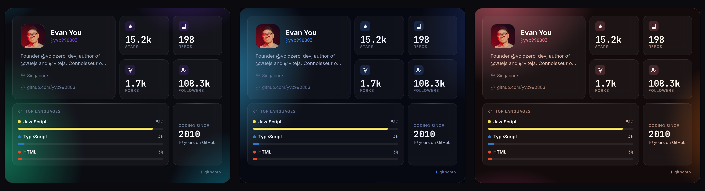
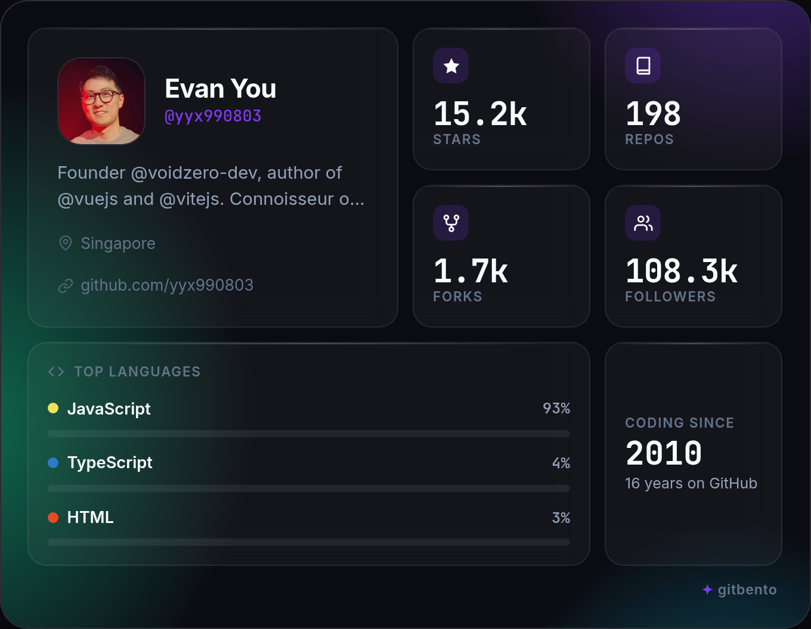
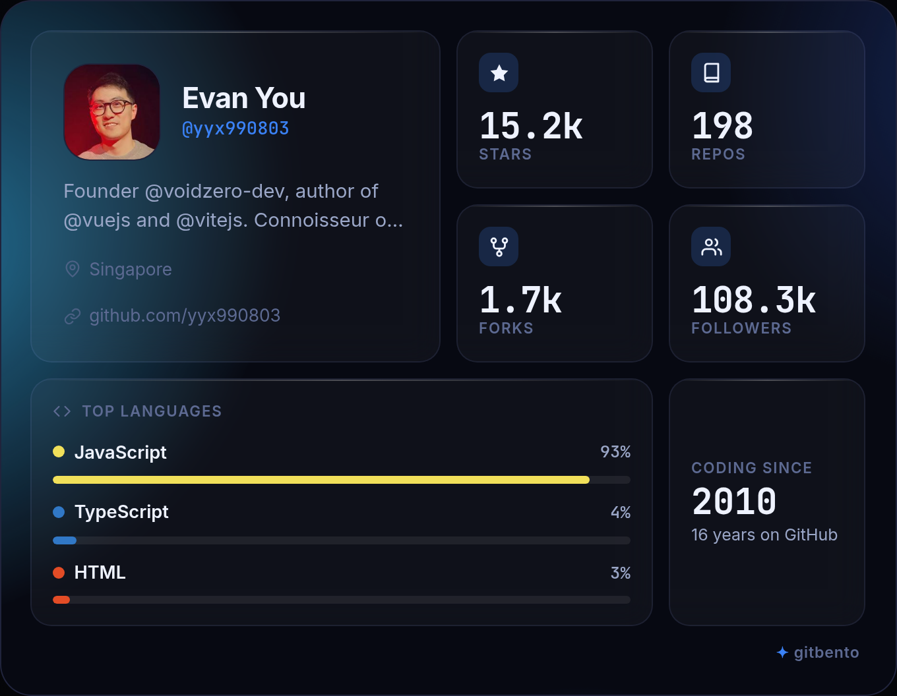
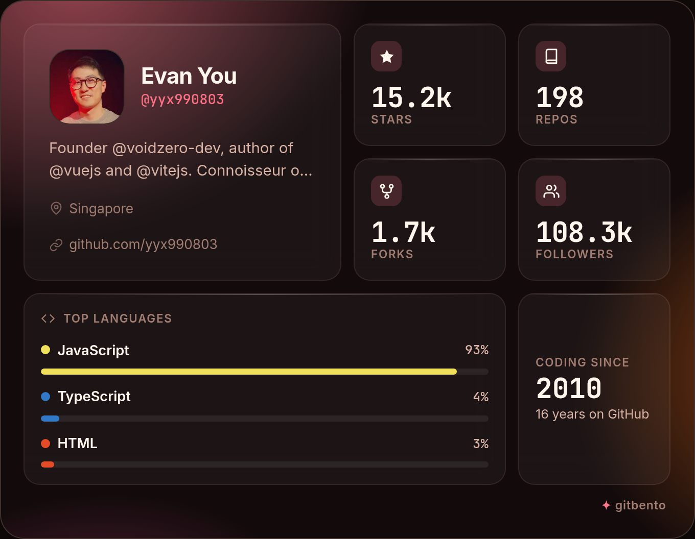

<div align="center">

# ✨ gitbento

**Generate beautiful bento-style GitHub profile cards in seconds.**

Animated · glassmorphic · free. No login, no backend — just your public GitHub data.

[](https://erik-automatizaciones.github.io/gitbento/)
[](#tech)
[](LICENSE)



<!-- Want a moving demo? Record one with Peek / Kooha on Linux and swap in assets/demo.gif -->

</div>

---

## What it does

Type a GitHub username → get an aesthetic **bento grid card** with avatar, total stars
and forks, repo and follower counts, your top languages with colored bars, and how long
you've been on GitHub. Then **download it as a PNG** or **copy a Markdown embed** for your
profile README.

## Themes

| Aurora (default) | Midnight | Sunset |
|:---:|:---:|:---:|
|  |  |  |

> Add real screenshots to `assets/` — generate your own card in each theme and download the PNG.

## Features

- 🎴 **Bento grid** — avatar, stars, forks, repos, followers, top languages, account age
- 🌌 **Animated aurora** gradient + glassmorphism on every panel
- 🎨 **3 themes** — Aurora, Midnight, Sunset (remembered between visits)
- 🖼️ **Download PNG** at 2× resolution (retina-crisp screenshots)
- 📋 **Copy for README** — one-click Markdown embed
- 🔗 **Shareable links** — `?user=username` auto-generates the card on load
- 📱 **Responsive** — looks great as a phone screenshot too
- 🎉 Confetti on download, loading skeleton, friendly error + rate-limit states

<a name="tech"></a>
## Tech

Pure **HTML + CSS + vanilla JS** (ES modules). Zero build step. The only dependency is
[`html2canvas`](https://html2canvas.hertzen.com/) (via CDN) for PNG export. Data comes from
the public **GitHub REST API v3** — no token required.

```
index.html        # markup + meta/SEO
style.css         # base styles, bento layout, animations
app.js            # fetch · render · export
themes/           # aurora.css · midnight.css · sunset.css
```

## Add to your profile in 3 steps

1. Open **[gitbento](https://erik-automatizaciones.github.io/gitbento/)** and generate your card.
2. Click **Copy for README** to grab the Markdown embed.
3. Paste it into your `README.md` on `github.com/<you>/<you>`. Done.

```md

```

## Run locally

No build tools needed — it's static files. Just serve the folder:

```bash
# any static server works; pick one
python3 -m http.server 8000
# then open http://localhost:8000
```

Opening `index.html` directly also works, though a local server is recommended so the
ES module and the GitHub API requests behave exactly like in production.

## Contributing

PRs welcome! Good first contributions:

- New themes (drop a `themes/<name>.css` defining the CSS custom properties and add a swatch)
- More language colors in `LANG_COLORS` (`app.js`)
- New bento cells (most-starred repo, contribution streak, etc.)

Keep it dependency-free (html2canvas aside), use the existing CSS custom properties for all
colors, and make sure the PNG export still looks right (`backdrop-filter` doesn't render in
html2canvas — translucent `rgba` backgrounds do).

## License

[MIT](LICENSE) © gitbento contributors
